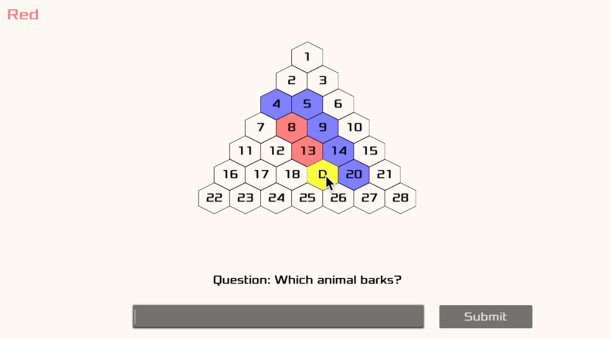

# Godot Quiz

This is my take on the popular [AZ-kvíz](https://cs.wikipedia.org/wiki/AZ-kv%C3%ADz) game.
With an intention to look into Godot and its capabilities, I decided to create a simple game that would be fun to play with friends.

My understanding of the game mechanics:

1. The goal of the game is to construct a path that connects all three sides of the triangle.
1. When a team moves, they select a tile.
1. A question is displayed, with the first 2 letters of each word as hints.
1. The team answers the question using a textbox and clicks 'submit'.
1. If the team answers the question incorrectly, the second team has a chance to answer.
1. If the first team answers correctly, they take ownership of the tile, and the second team gets a turn.
1. If the second team answers correctly, they take ownership of the tile with their color.
1. If both teams answer, the tile becomes black, and the first team gets another turn.
1. If a team selects a black tile, a closed yes/no question is displayed without any hints.
1. If the team answers correctly, they claim the tile with their color, and the turn goes to the rival team. If they answer incorrectly, the rival team claims the tile, and the current team keeps the turn.

## Running the Game

Install [Godot 4.1](https://godotengine.org/) for your platform. Open the project, select the `main.tscn` scene and run it.

## Running Tests

There are tests written for the core game logic (pathfinding, etc.). The tests rely on the `GUT (Godot Unit Test)` add-on. To run the tests, configure the add-on with the `res://test` subdir and hit `Run all`.
## Question Pools

There are two separate question pools in JSON format inside `res://data` directory. The first pool contains open-ended questions, the second one contains yes/no questions.
